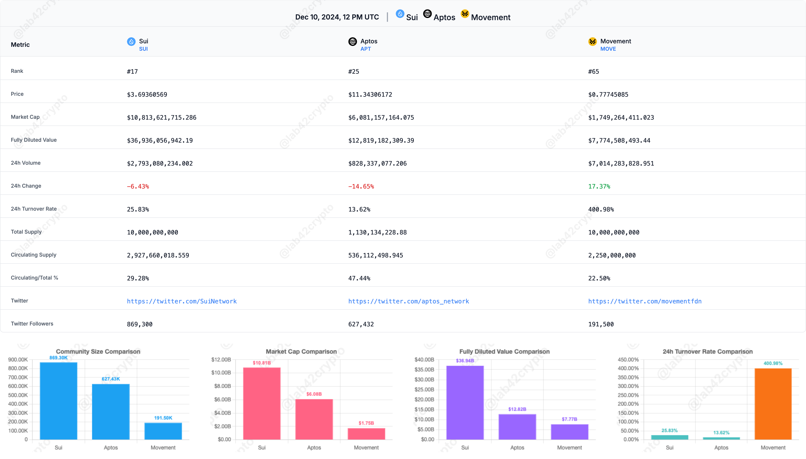

# Crypto Comparison Tool

A real-time cryptocurrency comparison tool that allows users to analyze and compare multiple cryptocurrencies across various metrics including market data, social metrics, and supply information.

## Example

You can compare tokens by:

1. Direct URL: `http://localhost:3000/?tokenids=20947,32452,21794`

   - MOVE
   - SUI
   - APTOS

2. Using the search bar:
   - Search by name or symbol
   - Select multiple tokens
   - Click "Compare Selected Tokens"



## Features

- Multi-token comparison with unlimited selection
- Real-time market data from CoinMarketCap
- Twitter follower tracking with suspension detection
- Interactive and sortable comparison tables
- Dynamic charts with auto-scaling
- Downloadable comparison tables and charts
- Responsive design
- UTC time synchronization
- Automatic data formatting for readability
- Smart token search with ranking algorithm
- Drag-and-drop token reordering

## Tech Stack

- **Framework**: Next.js 13+ (App Router)
- **Language**: TypeScript
- **Styling**: Tailwind CSS
- **Charts**: Chart.js
- **Data Sources**:
  - CoinMarketCap API
  - Twitter Web Scraping
- **Image Generation**: html2canvas
- **Drag and Drop**: react-beautiful-dnd
- **Icons**: Font Awesome

## Prerequisites

- Node.js 16+
- npm or yarn
- CoinMarketCap API Key
- Twitter Bearer Token (optional)

## Environment Setup

Create a `.env.local` file in the root directory with the following variables:

```conf
# Required
CMC_API_KEY=your_coinmarketcap_api_key
NEXT_PUBLIC_CMC_API_KEY=your_coinmarketcap_api_key
# Optional - for Twitter API access
TWITTER_BEARER_TOKEN=your_twitter_bearer_token
# Cache durations in milliseconds (default: 4 hours = 4 60 60 1000)
TWITTER_CACHE_DURATION=14400000
TOKEN_LIST_CACHE_DURATION=14400000
```

### Environment Variables Explanation

- `CMC_API_KEY`: Your CoinMarketCap API key for server-side requests
- `NEXT_PUBLIC_CMC_API_KEY`: Same key for client-side requests
- `TWITTER_BEARER_TOKEN`: Twitter API bearer token (optional)
- `TWITTER_CACHE_DURATION`: How long to cache Twitter follower counts (default: 4 hours)
- `TOKEN_LIST_CACHE_DURATION`: How long to cache token list (default: 4 hours)

## Installation

1. Clone the repository:

2. Install dependencies:

```bash
  npm install # or yarn install
```

3. Set up environment variables:

- Copy `.env.example` to `.env.local`
- Fill in your API keys and adjust cache durations if needed

4. Start the development server:

```bash

npm run dev# oryarn dev

```

5. Open [http://localhost:3000](http://localhost:3000) in your browser

## Caching System

The application implements two types of caching:

- **Token List Cache**: Stores full list of tokens from CoinMarketCap
- **Twitter Followers Cache**: Stores follower counts and suspension status

Cache files are stored in the `cache/` directory:

- `token-list-cache.json`
- `twitter-followers-cache.json`

Cache durations can be configured via environment variables.

## Features in Detail

### Market Data

- Price
- Market Cap
- Fully Diluted Value (FDV)
- 24h Volume
- 24h Price Change
- Turnover Rate

### Supply Metrics

- Total Supply
- Circulating Supply
- Supply Ratio

### Social Metrics

- Twitter Followers
- Twitter Profile Links
- Suspension Detection

### Export Options

- Download comparison table
- Download metric charts
- Download complete analysis

## Contributing

1. Fork the repository
2. Create your feature branch (`git checkout -b feature/AmazingFeature`)
3. Commit your changes (`git commit -m 'Add some AmazingFeature'`)
4. Push to the branch (`git push origin feature/AmazingFeature`)
5. Open a Pull Request

## License

This project is licensed under the MIT License - see the LICENSE file for details

## Acknowledgments

- CoinMarketCap for market data
- Chart.js community for visualization tools
